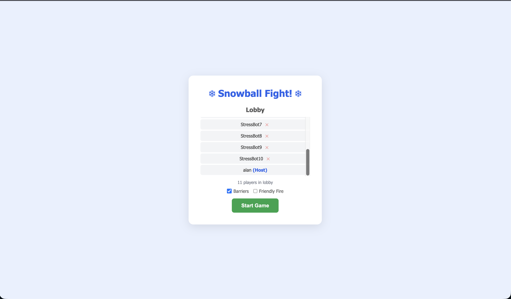
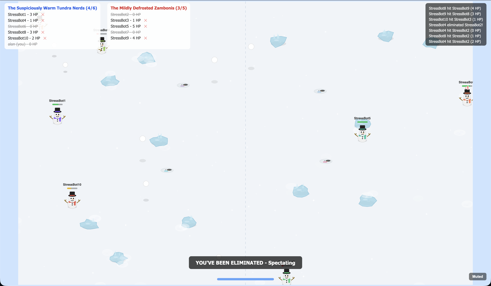
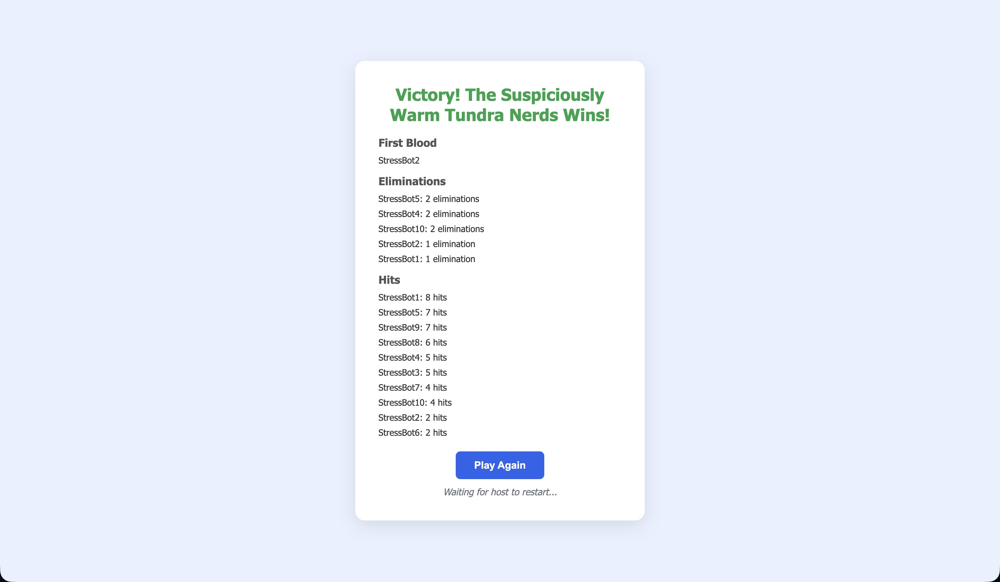
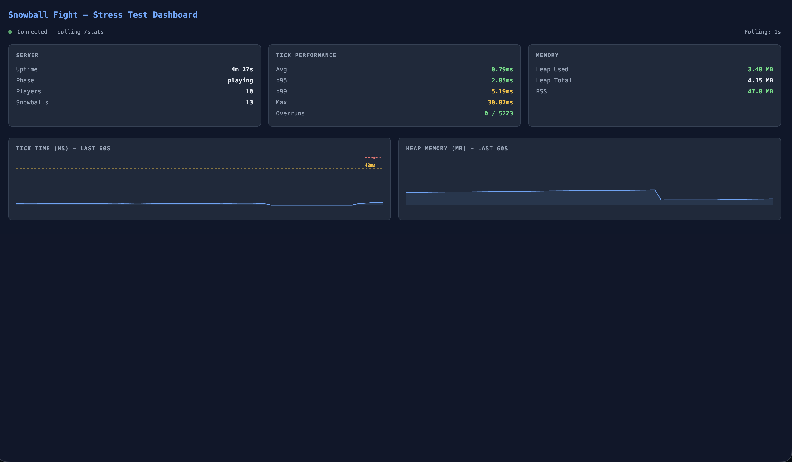
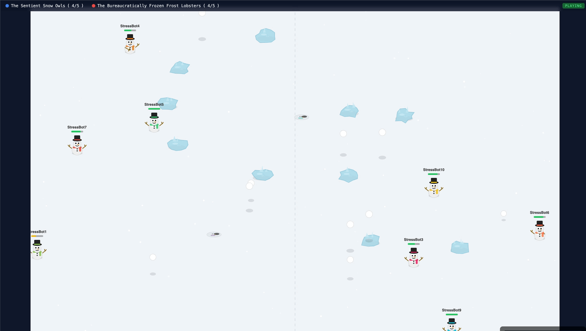

# Snowball Fight

Multiplayer browser party game — 2-11 players split into two teams, throw snowballs until one side is eliminated. No login, no auth, just enter a name and play.

## Screens

### Lobby



### Gameplay


### Eliminated spectator



### End Screen



### Profiling



### Spectator for stress testing



## Quick Start

```bash
bun install
bun run server.js
# Open http://localhost:3000
```

Dev mode (auto-restart on file changes):
```bash
bun --watch run server.js
```

## How to Play

1. Open the URL, enter a name, join the lobby
2. Host clicks "Start Game" (need 2+ players)
3. WASD to move, Q/E to aim, Space (hold + release) to throw
4. Hit enemies 5 times to eliminate them
5. Last team standing wins

## Features

- **State interpolation** — 60fps smooth rendering between 20Hz server ticks
- **AFK detection** — 15s no input marks AFK, 25s total kicks from game
- **Disconnect = elimination** — instant elimination, rejoin as spectator next round
- **Late join as spectator** — watch current game, auto-join next lobby
- **Host kick** — host can manually remove players from lobby or mid-game
- **Host disconnect recovery** — all players auto-return to lobby and rejoin
- **Tab visibility handling** — pauses rendering when tab hidden, resumes cleanly
- **Object pooling** — zero GPU texture leaks, stable memory over hours of play

## Tech Stack

- **Runtime:** Bun with `@socket.io/bun-engine` (native WebSocket, ~50% less memory than Node polyfill)
- **Frontend:** PixiJS v7 (CDN), vanilla JS ES modules
- **Networking:** Socket.IO, WebSocket-only transport
- **Assets:** 100% code-drawn (PixiJS Graphics), no sprite sheets
- **Sound:** Kenney CC0 audio + procedural Web Audio API

No build step. No bundler. No database.

## Stress Testing

Bot stress test to simulate multiplayer load:

```bash
# 8 bots, 60s, auto-starts
bun run stress-test.js

# Custom
BOTS=10 DURATION=120 bun run stress-test.js

# Against remote
SERVER=https://snowball-fight-production-25e4.up.railway.app BOTS=8 bun run stress-test.js
```

### Browser Monitoring

- **http://localhost:3000/spectate.html** — watch bots play live (full game canvas, no join required)
- **http://localhost:3000/stress.html** — real-time metrics dashboard (tick timing, memory charts)
- **In-game:** press backtick (`` ` ``) to toggle FPS/frame/state overlay

### Server Metrics

```bash
curl http://localhost:3000/stats
```

Returns JSON with tick timing (avg/p95/p99/max), memory usage, player count, and game phase.

## Deployment (Railway)

```bash
brew install railway
railway login
railway init
railway up
railway domain
```

Enable **Serverless** in settings for auto-sleep when idle ($0 cost when not playing).

## Project Structure

```
server.js              # Bun native serve + Socket.IO, game loop, all server logic
stress-test.js         # Bot stress test (dev tool)
public/
  index.html           # Game client
  spectate.html        # Spectator view (no join required)
  stress.html          # Live metrics dashboard
  js/
    main.js            # Entry point, screen manager
    game.js            # PixiJS app, object pools, input, rendering
    renderer.js        # Drawing functions (snowmen, forts, projectiles)
    lobby.js           # Lobby screen (DOM)
    network.js         # Socket.IO client wrapper
    sounds.js          # Audio playback + mute toggle
    constants.js       # Shared config
    perf-overlay.js    # Browser FPS/memory overlay
  css/style.css        # UI styling
  sounds/              # Kenney CC0 audio files
```